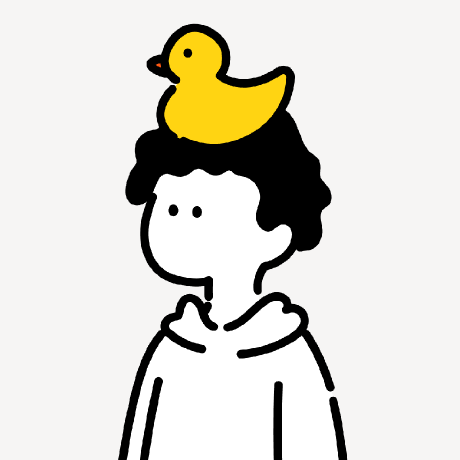

## {background-color="#0d0d0d" .center}

```{=html}
<div style="text-align: center; margin-top: 1em;">
  <div style="width: 250px; height: 250px; margin: 0 auto; border-radius: 50%; border: 3px solid #25D366; overflow: hidden; background: #ffffff;">
    
  </div>
  <h2 style="color: #ffffff; font-size: 2.2em; font-weight: bold; margin-top: 0.8em; letter-spacing: -0.02em;">Joseph Avila Alvarez</h2>
</div>
```

::: {.notes}
Saluda y preséntate brevemente. "Soy Joseph, desarrollador full-stack. Hoy vamos a construir juntos un chat en tiempo real desde cero, sin magia, entendiendo exactamente cómo funciona cada pieza." Máximo 30 segundos aquí.
:::

# ¿Cómo funciona WhatsApp? {background-color="#0d0d0d"}

## Cuando mandas un mensaje... {.center}

::: {.r-fit-text}
¿A dónde va? 🤔
:::

::: {.notes}
Pregunta retórica para enganchar. "Todos usamos WhatsApp todos los días, pero muy pocos sabemos qué pasa exactamente cuando presionamos Enviar. Hoy lo vamos a descubrir." Pausa dramática antes de pasar.
:::

## El mensaje no vuela solo {.center}

```{=html}
<div class="journey">
  <div class="journey-item fade-item" style="animation-delay:0.1s">
    <div class="j-icon">📱</div>
    <div class="j-label">Tu teléfono</div>
  </div>
  <div class="journey-arrow fade-item" style="animation-delay:0.5s">➔</div>
  <div class="journey-item fade-item" style="animation-delay:0.9s">
    <div class="j-icon">🏢</div>
    <div class="j-label">Servidor<br>WhatsApp</div>
  </div>
  <div class="journey-arrow fade-item" style="animation-delay:1.3s">➔</div>
  <div class="journey-item fade-item" style="animation-delay:1.7s">
    <div class="j-icon">📱</div>
    <div class="j-label">Tu amigo</div>
  </div>
</div>
```

::: {.fragment .fade-up}
::: {.box-muted}
Siempre hay un **servidor en el medio**. WhatsApp, Instagram, Slack, Discord — todos funcionan igual.
:::
:::

::: {.notes}
El punto clave: ningún mensaje llega directo de teléfono a teléfono. Siempre pasa por un servidor. Esto aplica a WhatsApp, Instagram, Slack, Discord, Teams — todos. El servidor es el árbitro. Aprovecha para preguntar: "¿Alguien sabía esto?" — genera participación.
:::

# HTTP — el cartero viejo 📬 {background-color="#0d0d0d"}

## Así funciona una página web normal {auto-animate=true}

```{=html}
<div class="http-anim" id="http-scene">
  <div class="actor" id="act-browser">
    <div class="actor-icon">💻</div>
    <div class="actor-name">Tu Browser</div>
  </div>
  <div class="http-lane" id="http-lane">
  </div>
  <div class="actor" id="act-server">
    <div class="actor-icon">🖥️</div>
    <div class="actor-name">Servidor</div>
  </div>
</div>

<div id="http-msg" class="http-step-msg"></div>

<div class="btn-row">
  <button class="demo-btn" onclick="httpStep()">▶ Siguiente paso</button>
  <button class="demo-btn demo-btn-ghost" onclick="httpReset()">↺ Reiniciar</button>
</div>

<script>
var httpStepN = 0;
var httpSteps = [
  { msg: "1️⃣  Browser pide la página:  GET /inicio", arrow: "→", cls: "arrow-out", label: "¿Qué hay en tu web?" },
  { msg: "2️⃣  Servidor responde con el HTML", arrow: "←", cls: "arrow-in", label: "Aquí tienes el HTML" },
  { msg: "3️⃣  Conexión cerrada ✗ — listo.", arrow: null, cls: "", label: "👋 Adiós" },
];

function httpStep() {
  var lane = document.getElementById('http-lane');
  var msgEl = document.getElementById('http-msg');
  if (httpStepN >= httpSteps.length) return;
  var s = httpSteps[httpStepN];
  msgEl.textContent = s.msg;
  msgEl.classList.add('msg-visible');
  if (s.arrow) {
    var arr = document.createElement('div');
    arr.className = 'http-arrow ' + s.cls;
    arr.innerHTML = s.arrow + ' <span class="arr-label">' + s.label + '</span>';
    lane.appendChild(arr);
    setTimeout(function(){ arr.classList.add('arr-show'); }, 50);
  } else {
    lane.innerHTML += '<div class="conn-close">✗ Conexión cerrada</div>';
  }
  httpStepN++;
}

function httpReset() {
  httpStepN = 0;
  document.getElementById('http-lane').innerHTML = '';
  var m = document.getElementById('http-msg');
  m.textContent = '';
  m.classList.remove('msg-visible');
}
</script>
```

::: {.notes}
Haz clic en "Siguiente paso" para animar cada fase. Explica mientras avanza: "El browser pide → el servidor responde → y la conexión se CIERRA. Esto es HTTP: una conversación de una sola vez. Como mandar una carta y esperar respuesta. Perfectamente válido para cargar páginas... pero terrible para un chat."
:::

## El problema para un chat {auto-animate=true}

::: {data-id="polling-title"}
Con HTTP tienes que **preguntar cada segundo:**
:::

::: {.notes}
Esta slide es la transición. Haz una pausa y pregunta: "Si HTTP cierra la conexión... ¿cómo le llegan los mensajes nuevos?" Déjalos pensar 2-3 segundos antes de pasar.
:::

## El problema para un chat {auto-animate=true}

::: {data-id="polling-title"}
Con HTTP tienes que **preguntar cada segundo:**
:::

```{=html}
<div class="polling-demo">
  <div class="poll-row"><span class="poll-q">Browser → "¿Hay mensajes?"</span> <span class="poll-a poll-no">← No.</span></div>
  <div class="poll-row"><span class="poll-q">Browser → "¿Hay mensajes?"</span> <span class="poll-a poll-no">← No.</span></div>
  <div class="poll-row"><span class="poll-q">Browser → "¿Hay mensajes?"</span> <span class="poll-a poll-no">← No.</span></div>
  <div class="poll-row"><span class="poll-q">Browser → "¿Hay mensajes?"</span> <span class="poll-a poll-no">← No.</span></div>
  <div class="poll-row"><span class="poll-q">Browser → "¿Hay mensajes?"</span> <span class="poll-a poll-yes">← ¡Sí! "Hola 👋"</span></div>
</div>
```

::: {.fragment .fade-up}
::: {.box-accent}
Esto se llama **polling** — y es como llamar al cartero cada minuto para preguntar si llegó algo. 📬
:::
:::

::: {.notes}
"Esta técnica se llama polling. Es la solución más obvia pero la más costosa. Noten que el browser pregunta una y otra vez y casi siempre la respuesta es 'No'. Imagina hacer esto con miles de usuarios simultáneos." Espera el fragmento con la caja antes de pasar.
:::

## En números reales 🔥

```{=html}
<div class="numbers-reveal">
  <div class="num-block fade-item" style="animation-delay:0.2s">
    <span class="big-num">1.000</span>
    <span class="num-desc">usuarios en el chat</span>
  </div>
  <div class="num-op fade-item" style="animation-delay:0.6s">×</div>
  <div class="num-block fade-item" style="animation-delay:1.0s">
    <span class="big-num">1</span>
    <span class="num-desc">request / segundo</span>
  </div>
  <div class="num-op fade-item" style="animation-delay:1.4s">=</div>
  <div class="num-block num-block-hot fade-item" style="animation-delay:1.8s">
    <span class="big-num">1.000</span>
    <span class="num-desc">requests / segundo 🔥</span>
  </div>
</div>
```

::: {.fragment .fade-up}
::: {.box-accent}
Y de esas 1.000 requests... **el 99% responden "No hay nada."**

Le estás gritando al cartero mil veces y casi nunca tiene carta.
:::
:::

::: {.notes}
"Mil requests por segundo. Eso son 60,000 por minuto, 3.6 millones por hora. Y el 99% no sirven de nada. Esto mata servidores y satura la red. Necesitamos algo completamente diferente." Aquí está el momento de tensión antes de revelar la solución.
:::

# WebSocket — el teléfono que no cuelga ☎️ {background-color="#0d0d0d"}

## La analogía perfecta

:::: {.columns}
::: {.column width="50%"}

::: {.box-muted}
**HTTP = Cartas por correo** 📬

Escribes → Mandas → Esperas → Recibes respuesta → **Se termina**

Para otra cosa: empiezas de cero otra vez.
:::

:::
::: {.column width="50%"}

::: {.fragment .fade-left}
::: {.box-accent}
**WebSocket = Llamada telefónica** ☎️

Marcas una vez → Canal abierto → Hablas cuando quieras → Escuchas cuando quieras

**La línea no se corta hasta que tú la cierras.**
:::
:::

:::
::::

::: {.notes}
"La diferencia es fundamental. HTTP es como mandar cartas: cada mensaje es independiente, la conexión muere. WebSocket es como una llamada: marcas una vez y el canal queda abierto indefinidamente. Cualquiera de los dos lados puede hablar en cualquier momento sin esperar turno." Espera el fragmento antes de continuar.
:::

## Cómo se abre la conexión WebSocket {auto-animate=true}

```{=html}
<div class="ws-scene" id="ws-scene">
  <div class="ws-actor">
    <div class="ws-icon">📱</div>
    <div class="ws-name">Tu browser</div>
  </div>
  <div class="ws-middle" id="ws-middle">
    <div class="ws-line ws-line-off" id="ws-line"></div>
  </div>
  <div class="ws-actor">
    <div class="ws-icon">🖥️</div>
    <div class="ws-name">Servidor</div>
  </div>
</div>
<div class="ws-status" id="ws-status">Canal: <span class="status-off">Cerrado ✗</span></div>
<div class="ws-log" id="ws-log"></div>

<div class="btn-row">
  <button class="demo-btn" onclick="wsStep()">▶ Siguiente</button>
  <button class="demo-btn demo-btn-ghost" onclick="wsReset()">↺ Reiniciar</button>
</div>

<script>
var wsN = 0;
var wsSteps = [
  { log: '📤 Browser → "¿Podemos abrir un canal WebSocket?"', status: null },
  { log: '📥 Servidor → "¡Claro! Canal abierto."', status: 'open' },
  { log: '💬 Browser → Servidor: "Hola Ana!"', status: null },
  { log: '💬 Servidor → Browser: "Hola Carlos! 👋"', status: null },
  { log: '💬 Servidor → Browser: "Ana dice: ¿cómo estás?"', status: null },
  { log: '💬 Browser → Servidor: "¡Muy bien!"', status: null },
];
function wsStep() {
  if (wsN >= wsSteps.length) return;
  var s = wsSteps[wsN];
  var log = document.getElementById('ws-log');
  var line = document.createElement('div');
  line.className = 'ws-log-line';
  line.textContent = s.log;
  log.appendChild(line);
  log.scrollTop = log.scrollHeight;
  if (s.status === 'open') {
    document.getElementById('ws-line').classList.remove('ws-line-off');
    document.getElementById('ws-line').classList.add('ws-line-on');
    document.getElementById('ws-status').innerHTML = 'Canal: <span class="status-on">Abierto 🟢 (permanente)</span>';
  }
  wsN++;
}
function wsReset() {
  wsN = 0;
  document.getElementById('ws-log').innerHTML = '';
  document.getElementById('ws-line').classList.remove('ws-line-on');
  document.getElementById('ws-line').classList.add('ws-line-off');
  document.getElementById('ws-status').innerHTML = 'Canal: <span class="status-off">Cerrado ✗</span>';
}
</script>
```

::: {.notes}
Usa los botones para animar. "Primero el browser pide abrir un WebSocket — esto es el 'handshake'. El servidor acepta y desde ese momento el canal está verde, abierto. Ahora miren: los mensajes fluyen en ambas direcciones sin pedir permiso cada vez. Ni el servidor ni el cliente tienen que iniciar una nueva conexión para hablar."
:::

## HTTP vs WebSocket — visual {.center}

```{=html}
<div class="vs-layout">

  <div class="vs-col">
    <div class="vs-title">🐌 HTTP Polling</div>
    <div class="vs-content">
      <div class="vs-row"><span class="pill red">→ ¿Hay msgs?</span><span class="pill grey">← No.</span></div>
      <div class="vs-row"><span class="pill red">→ ¿Hay msgs?</span><span class="pill grey">← No.</span></div>
      <div class="vs-row"><span class="pill red">→ ¿Hay msgs?</span><span class="pill grey">← No.</span></div>
      <div class="vs-row"><span class="pill red">→ ¿Hay msgs?</span><span class="pill green">← ¡Sí! "Hola"</span></div>
      <div class="vs-row"><span class="pill red">→ ¿Hay msgs?</span><span class="pill grey">← No.</span></div>
    </div>
    <div class="vs-footer bad">Muchas conexiones. Casi siempre vacías.</div>
  </div>

  <div class="vs-divider">VS</div>

  <div class="vs-col">
    <div class="vs-title">⚡ WebSocket</div>
    <div class="vs-content ws-channel-box">
      <div class="ws-channel-bar">🟢 CANAL ABIERTO</div>
      <div class="ws-msg out">→ "Hola Ana!"</div>
      <div class="ws-msg in">← "Hola Carlos!"</div>
      <div class="ws-msg in">← "¿Cómo estás? 😊"</div>
      <div class="ws-msg out">→ "¡Muy bien!"</div>
      <div class="ws-msg in">← "Me alegra 🎉"</div>
    </div>
    <div class="vs-footer good">1 sola conexión. Mensajes instantáneos.</div>
  </div>

</div>
```

::: {.notes}
"La comparación habla por sí sola. A la izquierda: conexiones que se abren y cierran constantemente, casi siempre para nada. A la derecha: una sola conexión abierta, mensajes que van y vienen instantáneamente. WebSocket no es solo más eficiente — es el único enfoque que tiene sentido para comunicación en tiempo real."
:::

# Socket.io — WebSocket sin dolor 🚀 {background-color="#0d0d0d"}

## ¿Qué es Socket.io?

:::: {.columns}
::: {.column width="55%"}

Socket.io es una librería de JavaScript que hace que los WebSockets sean **fáciles de usar**.

::: {.fragment .fade-up}
Imagina que construir WebSocket nativo es como fabricar tu propio teléfono desde cero.

**Socket.io ya te da el teléfono armado. 📞**
:::

:::
::: {.column width="45%"}

::: {.fragment .fade-up}
::: {.box-accent}
✅ Salas de chat incluidas

✅ Reconexión automática

✅ Funciona en todos los browsers

✅ Enviar mensajes a grupos

✅ Detectar quién se conecta y desconecta
:::
:::

:::
::::

::: {.notes}
"Socket.io envuelve WebSocket y le agrega superpoderes. Lo más valioso: la reconexión automática (si el usuario pierde wifi, Socket.io lo reconecta solo), las salas de chat (para grupos sin código extra), y la compatibilidad universal. Podrías usar WebSocket nativo... pero ¿para qué sufrir?"
:::

## La idea central — Eventos 🎯

::: {.fragment .fade-up}
En Socket.io todo funciona con **eventos**. Un evento es: *algo pasó, tiene un nombre*.
:::

::: {.fragment .fade-up}
```{=html}
<div class="events-grid">
  <div class="event-card">
    <div class="ev-icon">🔔</div>
    <div class="ev-name">"enviar-mensaje"</div>
    <div class="ev-desc">Alguien mandó texto</div>
  </div>
  <div class="event-card">
    <div class="ev-icon">👋</div>
    <div class="ev-name">"usuario-conectado"</div>
    <div class="ev-desc">Alguien entró al chat</div>
  </div>
  <div class="event-card">
    <div class="ev-icon">✍️</div>
    <div class="ev-name">"está-escribiendo"</div>
    <div class="ev-desc">Alguien tipea</div>
  </div>
  <div class="event-card">
    <div class="ev-icon">👋</div>
    <div class="ev-name">"usuario-salió"</div>
    <div class="ev-desc">Alguien cerró el chat</div>
  </div>
</div>
```
:::

::: {.fragment .fade-up}
::: {.box-muted}
Exactamente como la vida real: suena el timbre → *evento "timbre"* → abres la puerta.
:::
:::

::: {.notes}
"Todo en Socket.io gira alrededor de eventos con nombre. Tú defines los nombres — pueden ser cualquier string. 'enviar-mensaje', 'usuario-escribiendo', 'sala-llena' — lo que necesites. El sistema escucha esos nombres y reacciona. Es el patrón más intuitivo que existe para comunicación en tiempo real."
:::

## Solo dos palabras que necesitas saber {auto-animate=true}

::: {data-id="two-words"}
```{=html}
<div class="two-words">
  <div class="word-card" style="opacity:0.3">
    <div class="word-big">emit</div>
    <div class="word-meaning">???</div>
  </div>
  <div class="word-card" style="opacity:0.3">
    <div class="word-big">on</div>
    <div class="word-meaning">???</div>
  </div>
</div>
```
:::

::: {.notes}
Pausa de suspenso. "Hay exactamente dos palabras que necesitas aprender para dominar Socket.io. Solo dos. Las dos más importantes que existen en este ecosistema." Pausa 2 segundos antes de pasar a la siguiente slide.
:::

## Solo dos palabras que necesitas saber {auto-animate=true}

::: {data-id="two-words"}
```{=html}
<div class="two-words">
  <div class="word-card word-active">
    <div class="word-big">emit</div>
    <div class="word-meaning">📤 ENVIAR un evento</div>
    <div class="word-example">socket.emit("enviar-mensaje", "Hola!")</div>
  </div>
  <div class="word-card word-active">
    <div class="word-big">on</div>
    <div class="word-meaning">📥 ESCUCHAR un evento</div>
    <div class="word-example">socket.on("mensaje-nuevo", (msg) => { ... })</div>
  </div>
</div>
```
:::

::: {.fragment .fade-up}
::: {.box-accent}
Con `emit` y `on` construyes **cualquier feature de un chat real**. Eso es todo.
:::
:::

::: {.notes}
"emit = yo hablo. on = yo escucho. Con estas dos palabras puedes construir mensajes privados, notificaciones, indicador de escritura, estado en línea, reacciones... cualquier cosa. Cuando alguien dice que Socket.io es complejo, probablemente no sabe que todo se reduce a estas dos palabras."
:::

# El flujo completo — en vivo 🎬 {background-color="#0d0d0d"}

## ¿Qué pasa cuando mandas "Hola"? {auto-animate=true}

```{=html}
<div class="flow-scene" id="flow-scene">

  <div class="flow-actor" id="fa-carlos">
    <div class="fa-icon">📱</div>
    <div class="fa-name">Carlos</div>
    <div class="chat-preview" id="chat-carlos">
      <div class="cp-bubble cp-out">Hola 👋</div>
    </div>
  </div>

  <div class="flow-server" id="fa-server">
    <div class="fa-icon">🖥️</div>
    <div class="fa-name">Servidor</div>
    <div class="server-log-mini" id="slog">
      <span class="slog-idle">esperando...</span>
    </div>
  </div>

  <div class="flow-actor" id="fa-ana">
    <div class="fa-icon">📱</div>
    <div class="fa-name">Ana</div>
    <div class="chat-preview" id="chat-ana">
      <div class="cp-idle">...</div>
    </div>
  </div>

  <div class="flow-actor" id="fa-luis">
    <div class="fa-icon">📱</div>
    <div class="fa-name">Luis</div>
    <div class="chat-preview" id="chat-luis">
      <div class="cp-idle">...</div>
    </div>
  </div>

</div>

<div class="btn-row" style="margin-top:1em">
  <button class="demo-btn" onclick="flowPlay()">▶ Ver cómo viaja el mensaje</button>
  <button class="demo-btn demo-btn-ghost" onclick="flowReset()">↺ Reiniciar</button>
</div>

<script>
var flowPlaying = false;
function flowPlay() {
  if (flowPlaying) return;
  flowPlaying = true;

  // 1. Carlos emite
  var slog = document.getElementById('slog');
  setTimeout(function() {
    slog.innerHTML = '<span class="slog-recv">📨 emit "Hola" recibido</span>';
  }, 400);

  // 2. Servidor hace broadcast
  setTimeout(function() {
    slog.innerHTML += '<br><span class="slog-send">📡 broadcast a sala...</span>';
  }, 900);

  // 3. Llega a Ana
  setTimeout(function() {
    document.getElementById('chat-ana').innerHTML =
      '<div class="cp-bubble cp-in">Carlos: Hola 👋</div>';
  }, 1400);

  // 4. Llega a Luis
  setTimeout(function() {
    document.getElementById('chat-luis').innerHTML =
      '<div class="cp-bubble cp-in">Carlos: Hola 👋</div>';
    slog.innerHTML += '<br><span class="slog-ok">✅ entregado (< 50ms)</span>';
  }, 1800);
}
function flowReset() {
  flowPlaying = false;
  document.getElementById('slog').innerHTML = '<span class="slog-idle">esperando...</span>';
  document.getElementById('chat-ana').innerHTML = '<div class="cp-idle">...</div>';
  document.getElementById('chat-luis').innerHTML = '<div class="cp-idle">...</div>';
}
</script>
```

::: {.notes}
Haz clic en "Ver cómo viaja el mensaje" y narra mientras pasa: "Carlos emite el evento. El servidor lo recibe en millisegundos. Hace broadcast a todos los conectados a la sala. Ana lo recibe. Luis lo recibe. Todo en menos de 50ms — en tiempo real." Puedes repetir la animación si el grupo lo pide.
:::

## El indicador "está escribiendo..." ✍️

::: {.fragment .fade-up}
¿Alguna vez te preguntaste cómo funciona eso?
:::

```{=html}
<div class="typing-demo">
  <div class="td-chat">
    <div class="td-bubble in">Hola!</div>
    <div class="td-typing" id="typing-ind" style="display:none">
      <span class="td-dot"></span>
      <span class="td-dot"></span>
      <span class="td-dot"></span>
      <span style="color:#999; font-size:0.8em; margin-left:6px">Ana está escribiendo...</span>
    </div>
  </div>
  <div class="btn-row" style="margin-top:0.8em">
    <button class="demo-btn" onclick="showTyping()">✍️ Ana empieza a escribir</button>
  </div>
</div>

<script>
function showTyping() {
  document.getElementById('typing-ind').style.display = 'flex';
  setTimeout(function() {
    document.getElementById('typing-ind').style.display = 'none';
    var chat = document.querySelector('.td-chat');
    var b = document.createElement('div');
    b.className = 'td-bubble in';
    b.textContent = '¿Cómo estás? 😊';
    chat.appendChild(b);
  }, 2500);
}
</script>
```

::: {.fragment .fade-up}
::: {.box-muted}
Cada letra que tipeas dispara un evento `"escribiendo"`. El servidor lo reenvía. Los demás lo ven. Cuando el mensaje llega → el indicador desaparece.
:::
:::

::: {.notes}
Haz clic en el botón para mostrar el indicador de escritura. "Algo tan simple como los tres puntitos de 'está escribiendo' es puro Socket.io. Cada keystroke emite un evento. El servidor lo reenvía. Cuando se envía el mensaje, el evento 'dejó de escribir' borra el indicador. Son literalmente 4 líneas de código extra."
:::

## Demo — prueba el chat tú mismo 💬

```{=html}
<div class="live-chat">

  <div class="lc-window">
    <div class="lc-header">📱 Tú</div>
    <div class="lc-msgs" id="lc-msgs-you">
      <div class="lc-bubble lc-in">Hola! ¿cómo estás?</div>
      <div class="lc-bubble lc-out">¡Muy bien! ¿y tú?</div>
    </div>
    <div class="lc-input-row">
      <input id="lc-input-you" class="lc-input" placeholder="Escribe algo..."/>
      <button class="lc-send" onclick="lcSend('you')">➤</button>
    </div>
  </div>

  <div class="lc-server">
    <div class="lc-server-icon">🖥️</div>
    <div class="lc-server-label">Servidor</div>
    <div class="lc-server-log" id="lc-slog">
      <div class="lc-slog-line dim">en espera...</div>
    </div>
  </div>

  <div class="lc-window">
    <div class="lc-header">📱 Tu amigo</div>
    <div class="lc-msgs" id="lc-msgs-friend">
      <div class="lc-bubble lc-out">Hola! ¿cómo estás?</div>
      <div class="lc-bubble lc-in">¡Muy bien! ¿y tú?</div>
    </div>
    <div class="lc-input-row">
      <input id="lc-input-friend" class="lc-input" placeholder="Escribe algo..."/>
      <button class="lc-send" onclick="lcSend('friend')">➤</button>
    </div>
  </div>

</div>

<script>
function lcSend(from) {
  var inputId = 'lc-input-' + from;
  var el = document.getElementById(inputId);
  var txt = el.value.trim();
  if (!txt) return;
  el.value = '';
  var other = from === 'you' ? 'friend' : 'you';
  var fromLabel = from === 'you' ? 'Tú' : 'Tu amigo';

  // Mostrar burbuja en el emisor
  addLcBubble('lc-msgs-' + from, txt, 'lc-out');

  // Log servidor
  var slog = document.getElementById('lc-slog');
  slog.innerHTML = '';
  addSlogLine('📨 emit("enviar-mensaje") recibido', 'active');
  setTimeout(function(){ addSlogLine('📡 io.emit("mensaje-nuevo") → todos', 'active'); }, 350);

  // Entregar al otro
  setTimeout(function(){
    addLcBubble('lc-msgs-' + other, fromLabel + ': ' + txt, 'lc-in');
    addSlogLine('✅ entregado en < 50ms', 'done');
  }, 700);
}

function addLcBubble(containerId, txt, cls) {
  var c = document.getElementById(containerId);
  var b = document.createElement('div');
  b.className = 'lc-bubble ' + cls + ' lc-new';
  b.textContent = txt;
  c.appendChild(b);
  c.scrollTop = c.scrollHeight;
  setTimeout(function(){ b.classList.remove('lc-new'); }, 400);
}

function addSlogLine(txt, cls) {
  var slog = document.getElementById('lc-slog');
  var d = document.createElement('div');
  d.className = 'lc-slog-line ' + cls;
  d.textContent = txt;
  slog.appendChild(d);
}

['you','friend'].forEach(function(who){
  document.getElementById('lc-input-' + who)
    .addEventListener('keydown', function(e){ if(e.key==='Enter') lcSend(who); });
});
</script>
```

::: {.box-muted}
Escribe un mensaje en cualquier ventana 👆 — así funciona Socket.io por dentro.
:::

::: {.notes}
Invita al público a interactuar: "Abran el chat en pantalla compartida si están en vivo, o si están en persona pasen el control. Prueben enviar mensajes de ambos lados." Deja 1-2 minutos para la interacción. Señala el log del servidor: "Vean cómo el servidor procesa cada evento en tiempo real."
:::

# El código — lo mínimo indispensable 🧩 {background-color="#0d0d0d"}

## Solo 3 líneas en el servidor {auto-animate=true}

```{.javascript data-id="server-code"}
io.on("connection", (socket) => {
  // alguien se conectó
});
```

::: {.notes}
"Empezamos con lo mínimo. `io.on('connection')` — Socket.io llama a esta función cada vez que alguien se conecta. El parámetro `socket` representa a esa persona específica. Hasta aquí no hacemos nada, pero ya tenemos la puerta abierta."
:::

## Solo 3 líneas en el servidor {auto-animate=true}

```{.javascript data-id="server-code"}
io.on("connection", (socket) => {

  socket.on("enviar-mensaje", (texto) => {
    // recibí un mensaje → reenviar a todos
    io.emit("mensaje-nuevo", texto);
  });

});
```

::: {.fragment .fade-up}
::: {.box-muted}
Recibe → reenvía. Eso es todo el corazón del servidor de chat.
:::
:::

::: {.notes}
"Miren el corazón del servidor: cuando alguien emite 'enviar-mensaje', el servidor lo recibe y hace `io.emit('mensaje-nuevo')` — que se lo manda a TODOS los conectados, incluyendo quien lo envió. Eso es todo. Un chat funcional en menos de 10 líneas de código real."
:::

## Y en el cliente — también 3 líneas {auto-animate=true}

```{.javascript data-id="client-code"}
const socket = io("http://localhost:3001");
```

::: {.notes}
"Una línea. Con eso el cliente ya tiene un WebSocket abierto y persistente con el servidor. Socket.io maneja el handshake, el protocolo, los reintentos — todo. Esta línea es suficiente para tener la conexión."
:::

## Y en el cliente — también 3 líneas {auto-animate=true}

```{.javascript data-id="client-code"}
const socket = io("http://localhost:3001");

// Cuando llega un mensaje → mostrarlo
socket.on("mensaje-nuevo", (texto) => {
  mostrarEnPantalla(texto);
});

// Cuando el usuario envía → mandarlo
function enviar(texto) {
  socket.emit("enviar-mensaje", texto);
}
```

::: {.fragment .fade-up}
::: {.box-accent}
**`emit`** = envío · **`on`** = escucho

Dos palabras. Un chat funcionando.
:::
:::

::: {.notes}
"Aquí está el cliente completo. `socket.on` escucha mensajes nuevos y los muestra. `socket.emit` envía lo que escribe el usuario. Combinado con el servidor que vimos antes, esto es un chat en tiempo real funcionando. Pueden probarlo ahora mismo clonando el repo del webinar."
:::

# ¿Qué puedes construir con esto? 🚀 {background-color="#0d0d0d"}

## Las posibilidades son infinitas

```{=html}
<div class="possibilities">
  <div class="poss-card fade-item" style="animation-delay:0.1s">
    <div class="poss-icon">💬</div>
    <div class="poss-title">Chat en grupos</div>
    <div class="poss-desc">Como grupos de WhatsApp o servidores de Discord</div>
  </div>
  <div class="poss-card fade-item" style="animation-delay:0.3s">
    <div class="poss-icon">🎮</div>
    <div class="poss-title">Juego multijugador</div>
    <div class="poss-desc">Cada movimiento se transmite al instante</div>
  </div>
  <div class="poss-card fade-item" style="animation-delay:0.5s">
    <div class="poss-icon">📊</div>
    <div class="poss-title">Dashboard en vivo</div>
    <div class="poss-desc">Métricas que se actualizan solas, sin recargar</div>
  </div>
  <div class="poss-card fade-item" style="animation-delay:0.7s">
    <div class="poss-icon">✏️</div>
    <div class="poss-title">Doc colaborativo</div>
    <div class="poss-desc">Como Google Docs — varios editando a la vez</div>
  </div>
  <div class="poss-card fade-item" style="animation-delay:0.9s">
    <div class="poss-icon">🔔</div>
    <div class="poss-title">Notificaciones push</div>
    <div class="poss-desc">El servidor avisa al usuario sin que haga nada</div>
  </div>
  <div class="poss-card fade-item" style="animation-delay:1.1s">
    <div class="poss-icon">🏷️</div>
    <div class="poss-title">Subasta en vivo</div>
    <div class="poss-desc">El precio sube en tiempo real mientras todos lo ven</div>
  </div>
</div>
```

::: {.notes}
"Una vez que entiendes emit y on, todas estas cosas se vuelven triviales. Los juegos multijugador son solo posiciones emitidas como eventos. Un dashboard en vivo son métricas emitidas cada segundo. Un doc colaborativo son cambios emitidos a todos. El patrón es siempre el mismo — solo cambia el nombre del evento y el dato que llevas."
:::

## Lo que aprendiste hoy {.center}

```{=html}
<div class="summary-list">
  <div class="sum-item fade-item" style="animation-delay:0.1s">
    <span class="sum-num">01</span>
    <span class="sum-text"><strong>HTTP cierra la conexión</strong> — no puede recibir mensajes sin pedirlos</span>
  </div>
  <div class="sum-item fade-item" style="animation-delay:0.4s">
    <span class="sum-num">02</span>
    <span class="sum-text"><strong>WebSocket mantiene el canal abierto</strong> — mensajes en ambas direcciones, al instante</span>
  </div>
  <div class="sum-item fade-item" style="animation-delay:0.7s">
    <span class="sum-num">03</span>
    <span class="sum-text"><strong>Socket.io lo hace simple</strong> — <code>emit</code> para enviar, <code>on</code> para escuchar</span>
  </div>
  <div class="sum-item fade-item" style="animation-delay:1.0s">
    <span class="sum-num">04</span>
    <span class="sum-text"><strong>Next.js + Socket.io</strong> — el stack para construir tu propio WhatsApp hoy</span>
  </div>
</div>
```

::: {.notes}
"Repasemos lo que cubrimos hoy. Uno: HTTP cierra la conexión — no sirve para tiempo real. Dos: WebSocket mantiene el canal abierto — es la solución correcta. Tres: Socket.io lo hace accesible con emit y on. Cuatro: con Next.js como frontend tienes todo el stack para construir algo real hoy mismo." Pausa después de cada punto para que resuene.
:::

## Para arrancar ahora mismo

:::: {.columns}
::: {.column width="50%"}

```bash
# Crear el servidor
mkdir mi-chat && cd mi-chat
npm init -y
npm install socket.io express

# Crear el cliente Next.js
npx create-next-app@latest cliente
cd cliente
npm install socket.io-client

# Levantar todo
node servidor.js      # puerto 3001
npm run dev           # puerto 3000
```

:::
::: {.column width="50%"}

::: {.fragment .fade-up}
::: {.callout-tip}
**Recursos para seguir**

`socket.io/get-started/chat` — tutorial oficial

`nextjs.org/learn` — curso gratuito

Código completo de este webinar → link en el chat 👇
:::
:::

:::
::::

::: {.notes}
"Los comandos en pantalla son literalmente todo lo que necesitan para arrancar hoy. El repo con el código completo está en el chat — incluyendo el servidor Express, el cliente Next.js y todo configurado. Socket.io tiene uno de los mejores tutoriales de la industria, úsenlo. Y si tienen preguntas después del webinar, búsquenme en Twitter como @josephino."
:::

---

## {background-color="#000000" .center}

```{=html}
<div class="domain-expansion-slide" id="domain-slide">

  <!-- Full-viewport background video (revealed on click) -->
  <video class="de-bg" id="de-bg" src="video.mp4" loop muted playsinline preload="auto"></video>

  <!-- Full-viewport dark overlay -->
  <div class="de-overlay" id="de-overlay"></div>

  <!-- Full-viewport particles -->
  <div class="de-particles" id="de-particles"></div>

  <!-- Content -->
  <div class="de-content" id="de-content">
    <div class="de-kanji" id="de-kanji">呪域展開</div>
    <div class="de-title" id="de-title">DOMAIN EXPANSION</div>
    <div class="de-subtitle" id="de-subtitle">WebSocket — Demo</div>
    <div class="de-qr" id="de-qr">
      <div class="de-qr-box">🔗 Abre el chat en vivo</div>
      <div class="de-url">localhost:3000</div>
    </div>
  </div>

  <!-- Trigger button -->
  <button class="de-trigger" id="de-trigger" onclick="activateDomain()">⚡ ACTIVAR EXPANSIÓN</button>

</div>

<style>
/* The wrapper itself just centers the content */
.domain-expansion-slide {
  position: relative;
  display: flex;
  flex-direction: column;
  align-items: center;
  justify-content: center;
  min-height: 50vh;
  z-index: 10;
}

/* These will be moved to .reveal-viewport so they use 100% of the screen */
.de-bg {
  position: fixed; 
  inset: 0;
  width: 100vw;
  height: 100vh;
  object-fit: cover;
  object-position: center;
  opacity: 0;
  transition: opacity 1.2s ease;
  z-index: 0; /* above the Reveal black backgrounds, below slides */
  pointer-events: none;
}
.de-bg.active { opacity: 1; }

.de-overlay {
  position: fixed;
  inset: 0;
  width: 100vw;
  height: 100vh;
  background: radial-gradient(ellipse 80% 80% at 50% 50%,
    rgba(120,0,255,0.35) 0%,
    rgba(0,0,0,0.75) 65%,
    rgba(0,0,0,0.92) 100%);
  z-index: 1;
  opacity: 0;
  transition: opacity 1s ease 0.5s;
  pointer-events: none;
}
.de-overlay.active { opacity: 1; }

.de-particles {
  position: fixed;
  inset: 0;
  width: 100vw;
  height: 100vh;
  z-index: 2;
  pointer-events: none;
}
.de-particle {
  position: absolute;
  border-radius: 50%;
  animation: float-up linear infinite;
  opacity: 0;
}
@keyframes float-up {
  0%   { transform: translateY(0) scale(1); opacity: 0.8; }
  100% { transform: translateY(-120vh) scale(0.2); opacity: 0; }
}

.de-content {
  position: relative;
  z-index: 10;
  text-align: center;
  display: flex;
  flex-direction: column;
  align-items: center;
  gap: 0.5em;
}
.de-kanji {
  font-size: 3.5em;
  font-weight: 900;
  color: #fff;
  opacity: 0;
  text-shadow:
    0 0 20px #7c3aed,
    0 0 60px #7c3aed,
    0 0 120px #7c3aed;
  letter-spacing: 0.15em;
  transform: scale(0.1) rotate(-15deg);
  transition: all 0.9s cubic-bezier(0.34,1.56,0.64,1) 1.0s;
}
.de-kanji.active {
  opacity: 1;
  transform: scale(1) rotate(0deg);
}
.de-title {
  font-size: 2.4em;
  font-weight: 900;
  letter-spacing: 0.3em;
  text-transform: uppercase;
  color: #a855f7;
  opacity: 0;
  transform: translateY(30px);
  transition: all 0.8s ease 1.7s;
  text-shadow: 0 0 30px rgba(168,85,247,0.8);
}
.de-title.active {
  opacity: 1;
  transform: translateY(0);
}
.de-subtitle {
  font-size: 1.6em;
  font-weight: 700;
  color: #22d3ee;
  opacity: 0;
  transform: translateY(20px);
  transition: all 0.8s ease 2.2s;
  letter-spacing: 0.2em;
  text-shadow: 0 0 20px rgba(34,211,238,0.7);
}
.de-subtitle.active {
  opacity: 1;
  transform: translateY(0);
}
.de-qr {
  margin-top: 1.2em;
  opacity: 0;
  transform: translateY(20px);
  transition: all 0.8s ease 2.8s;
}
.de-qr.active {
  opacity: 1;
  transform: translateY(0);
}
.de-qr-box {
  background: rgba(168,85,247,0.2);
  border: 2px solid #a855f7;
  border-radius: 12px;
  padding: 0.5em 1.8em;
  font-size: 1.1em;
  color: #fff;
  font-weight: 700;
  box-shadow: 0 0 25px rgba(168,85,247,0.4);
}
.de-url {
  margin-top: 0.4em;
  font-size: 0.9em;
  color: #a855f7;
  font-family: monospace;
  letter-spacing: 0.1em;
}
.de-trigger {
  position: relative;
  z-index: 20;
  margin-top: 2em;
  background: linear-gradient(135deg, #7c3aed, #a855f7);
  color: #fff;
  border: none;
  border-radius: 999px;
  padding: 0.7em 2.2em;
  font-size: 1em;
  font-weight: 800;
  letter-spacing: 0.1em;
  cursor: pointer;
  box-shadow: 0 0 30px rgba(168,85,247,0.6);
  transition: all 0.3s;
  text-transform: uppercase;
}
.de-trigger:hover {
  transform: scale(1.06);
  box-shadow: 0 0 50px rgba(168,85,247,0.9);
}
.de-trigger.hidden { display: none; }

/* Screen flash */
@keyframes screen-flash {
  0%   { background: rgba(255,255,255,0); }
  20%  { background: rgba(255,255,255,0.95); }
  100% { background: rgba(255,255,255,0); }
}
.de-flash {
  position: fixed;
  inset: 0;
  z-index: 9999;
  pointer-events: none;
  animation: screen-flash 0.6s ease forwards;
}
</style>

<script>
(function() {
  function prepareDomainExpansion() {
    // Escapar de la escala de transform moviendo las capas al viewport global
    var viewport = document.querySelector('.reveal-viewport') || document.body;
    ['de-bg', 'de-overlay', 'de-particles'].forEach(function(id) {
      var el = document.getElementById(id);
      if (el && el.parentElement !== viewport) {
        viewport.appendChild(el);
      }
    });
  }
  if (document.readyState === 'loading') {
    document.addEventListener('DOMContentLoaded', prepareDomainExpansion);
  } else {
    prepareDomainExpansion();
  }
  // Backup por si Reveal hace rendering retardado
  setTimeout(prepareDomainExpansion, 500);
})();

function activateDomain() {

  // Screen flash over everything
  var flash = document.createElement('div');
  flash.className = 'de-flash';
  document.body.appendChild(flash);
  setTimeout(function(){ flash.remove(); }, 700);

  // Hide button
  document.getElementById('de-trigger').classList.add('hidden');

  // Activate bg (play video) + overlay
  setTimeout(function(){
    var bgVid = document.getElementById('de-bg');
    bgVid.classList.add('active');
    bgVid.currentTime = 0;
    bgVid.play().catch(function(e) { console.warn(e); });
    document.getElementById('de-overlay').classList.add('active');
  }, 200);

  // Spawn particles
  setTimeout(function(){
    spawnParticles();
  }, 400);

  // Activate text elements
  ['de-kanji','de-title','de-subtitle','de-qr'].forEach(function(id){
    document.getElementById(id).classList.add('active');
  });
}

function spawnParticles() {
  var container = document.getElementById('de-particles');
  var colors = ['#a855f7','#7c3aed','#22d3ee','#ffffff','#e879f9'];
  for (var i = 0; i < 60; i++) {
    (function(){
      var p = document.createElement('div');
      p.className = 'de-particle';
      var size = Math.random() * 8 + 3;
      var left = Math.random() * 100;
      var delay = Math.random() * 3;
      var dur = Math.random() * 4 + 3;
      var color = colors[Math.floor(Math.random() * colors.length)];
      p.style.cssText = [
        'width:' + size + 'px',
        'height:' + size + 'px',
        'left:' + left + '%',
        'bottom:-10px',
        'background:' + color,
        'animation-delay:' + delay + 's',
        'animation-duration:' + dur + 's',
        'box-shadow: 0 0 6px ' + color
      ].join(';');
      container.appendChild(p);
    })();
  }
}
</script>
```

::: {.notes}
Momento épico de la presentación. Haz clic en "ACTIVAR EXPANSIÓN" para la animación. "Y con esto... damos inicio al Domain Expansion — la demo en vivo. Abran localhost:3000 desde su navegador y prueben el chat real que construimos juntos." Deja que la animación corra completamente antes de hablar.
:::

---

::: {style="text-align:center; padding: 3em 0;"}

::: {.r-fit-text}
¡Gracias! 🎉
:::

[**@josephino**]{style="font-size:1.3em; color:#25D366;"}

[Preguntas en el chat ahora 🎙️]{.text-muted}

:::

::: {.notes}
Slide final. Agradece al público. "Gracias a todos por estar aquí. Si construyen algo con Socket.io, etiquétenme en Twitter — me encanta ver lo que hacen. Preguntas en el chat ahora mismo." Mantén esta slide mientras respondes preguntas — da un look profesional al cierre.
:::
